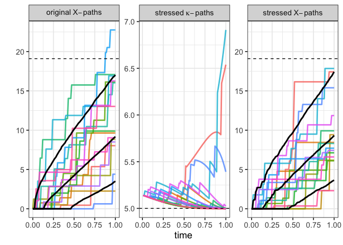
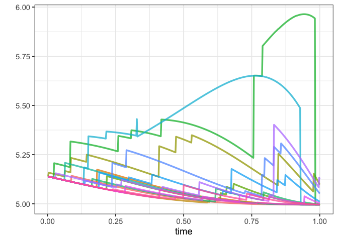
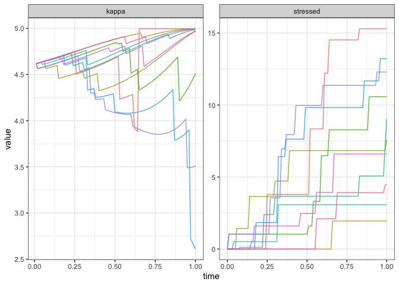
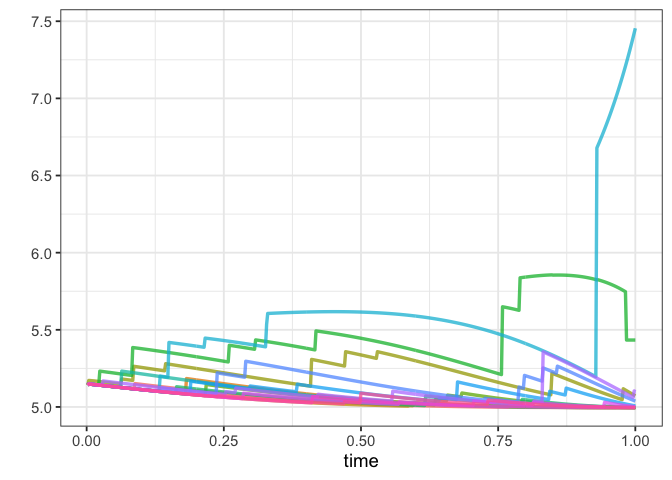
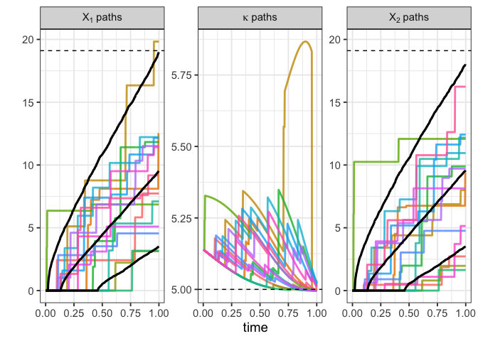
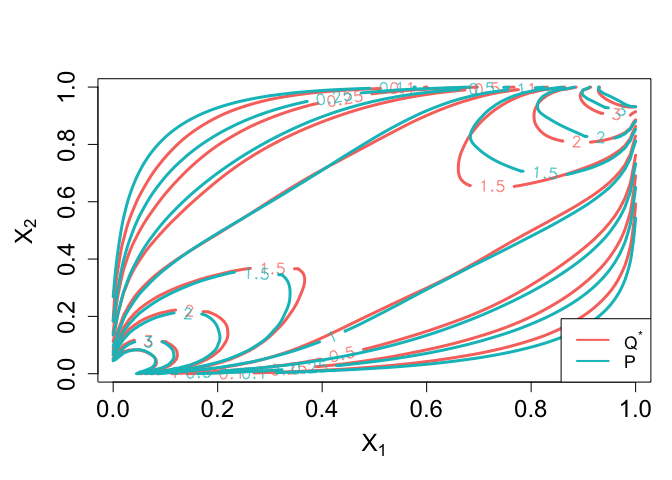

<!-- README.md is generated from README.Rmd. Please edit that file -->

# Stressing Dynamic Loss Models

<!-- badges: start -->
<!-- badges: end -->

This code implements the algorithms described in our paper “Stressing
Dynamic Loss Models” (Kroell, Pesenti, and Jaimungal, 2022). This is
joint work with Silvana M. Pesenti and Sebastian Jaimungal.

## Example

Below we provide a few examples of working with our code to stress
dynamic loss models, as described by compound Poisson processes.

In this example, we set the jump size distribution to
")
where

and
.
We first create a class containing all the information needed on this
random variable.

``` r
# jump size is Gamma(2,1) distributed
# Set up distribution class
gamma_2_1 <- RPS_dist_univ(dist_fun = function(x,parms) pgamma(x,shape=parms$alpha,
                                                               rate=parms$beta),
                           dens_fun = function(x,parms) dgamma(x,shape=parms$alpha,
                                                               rate=parms$beta),
                           sim_fun = function(x,parms) rgamma(x,shape=parms$alpha,
                                                              rate=parms$beta),
                           char_fun = function(x,parms) (1 - 1i*x/parms$beta)^(-parms$alpha),
                           min = 0,
                           max = qgamma(1-1e-10,shape=2,rate=1),
                           mean_fun = function(parms) parms$alpha/parms$beta,
                           parms = list(alpha = 2, beta=1))
```

We decide to stress the 90% VaR of the model up 10%. This code imposes
the stress and simulates under the model.

``` r
ex_gamma_VaR <- stressed_sim(kappa = 5, jump_dist = gamma_2_1, 
                             stress_type = "VaR",
                             stress_parms = list(c=0.9,VaR_stress=1.1),
                             Npaths=1e4, end_time=1, dt=2e-3)
#> No stress time specified. Applying stress at terminal time. 
#> eta: 0.4833721 
#>   |                                                          |                                                  |   0%  |                                                          |                                                  |   1%  |                                                          |=                                                 |   1%  |                                                          |=                                                 |   2%  |                                                          |=                                                 |   3%  |                                                          |==                                                |   3%  |                                                          |==                                                |   4%  |                                                          |==                                                |   5%  |                                                          |===                                               |   5%  |                                                          |===                                               |   6%  |                                                          |===                                               |   7%  |                                                          |====                                              |   7%  |                                                          |====                                              |   8%  |                                                          |====                                              |   9%  |                                                          |=====                                             |   9%  |                                                          |=====                                             |  10%  |                                                          |=====                                             |  11%  |                                                          |======                                            |  11%  |                                                          |======                                            |  12%  |                                                          |======                                            |  13%  |                                                          |=======                                           |  13%  |                                                          |=======                                           |  14%  |                                                          |=======                                           |  15%  |                                                          |========                                          |  15%  |                                                          |========                                          |  16%  |                                                          |========                                          |  17%  |                                                          |=========                                         |  17%  |                                                          |=========                                         |  18%  |                                                          |=========                                         |  19%  |                                                          |==========                                        |  19%  |                                                          |==========                                        |  20%  |                                                          |==========                                        |  21%  |                                                          |===========                                       |  21%  |                                                          |===========                                       |  22%  |                                                          |===========                                       |  23%  |                                                          |============                                      |  23%  |                                                          |============                                      |  24%  |                                                          |============                                      |  25%  |                                                          |=============                                     |  25%  |                                                          |=============                                     |  26%  |                                                          |=============                                     |  27%  |                                                          |==============                                    |  27%  |                                                          |==============                                    |  28%  |                                                          |==============                                    |  29%  |                                                          |===============                                   |  29%  |                                                          |===============                                   |  30%  |                                                          |===============                                   |  31%  |                                                          |================                                  |  31%  |                                                          |================                                  |  32%  |                                                          |================                                  |  33%  |                                                          |=================                                 |  33%  |                                                          |=================                                 |  34%  |                                                          |=================                                 |  35%  |                                                          |==================                                |  35%  |                                                          |==================                                |  36%  |                                                          |==================                                |  37%  |                                                          |===================                               |  37%  |                                                          |===================                               |  38%  |                                                          |===================                               |  39%  |                                                          |====================                              |  39%  |                                                          |====================                              |  40%  |                                                          |====================                              |  41%  |                                                          |=====================                             |  41%  |                                                          |=====================                             |  42%  |                                                          |=====================                             |  43%  |                                                          |======================                            |  43%  |                                                          |======================                            |  44%  |                                                          |======================                            |  45%  |                                                          |=======================                           |  45%  |                                                          |=======================                           |  46%  |                                                          |=======================                           |  47%  |                                                          |========================                          |  47%  |                                                          |========================                          |  48%  |                                                          |========================                          |  49%  |                                                          |=========================                         |  49%  |                                                          |=========================                         |  50%  |                                                          |=========================                         |  51%  |                                                          |==========================                        |  51%  |                                                          |==========================                        |  52%  |                                                          |==========================                        |  53%  |                                                          |===========================                       |  53%  |                                                          |===========================                       |  54%  |                                                          |===========================                       |  55%  |                                                          |============================                      |  55%  |                                                          |============================                      |  56%  |                                                          |============================                      |  57%  |                                                          |=============================                     |  57%  |                                                          |=============================                     |  58%  |                                                          |=============================                     |  59%  |                                                          |==============================                    |  59%  |                                                          |==============================                    |  60%  |                                                          |==============================                    |  61%  |                                                          |===============================                   |  61%  |                                                          |===============================                   |  62%  |                                                          |===============================                   |  63%  |                                                          |================================                  |  63%  |                                                          |================================                  |  64%  |                                                          |================================                  |  65%  |                                                          |=================================                 |  65%  |                                                          |=================================                 |  66%  |                                                          |=================================                 |  67%  |                                                          |==================================                |  67%  |                                                          |==================================                |  68%  |                                                          |==================================                |  69%  |                                                          |===================================               |  69%  |                                                          |===================================               |  70%  |                                                          |===================================               |  71%  |                                                          |====================================              |  71%  |                                                          |====================================              |  72%  |                                                          |====================================              |  73%  |                                                          |=====================================             |  73%  |                                                          |=====================================             |  74%  |                                                          |=====================================             |  75%  |                                                          |======================================            |  75%  |                                                          |======================================            |  76%  |                                                          |======================================            |  77%  |                                                          |=======================================           |  77%  |                                                          |=======================================           |  78%  |                                                          |=======================================           |  79%  |                                                          |========================================          |  79%  |                                                          |========================================          |  80%  |                                                          |========================================          |  81%  |                                                          |=========================================         |  81%  |                                                          |=========================================         |  82%  |                                                          |=========================================         |  83%  |                                                          |==========================================        |  83%  |                                                          |==========================================        |  84%  |                                                          |==========================================        |  85%  |                                                          |===========================================       |  85%  |                                                          |===========================================       |  86%  |                                                          |===========================================       |  87%  |                                                          |============================================      |  87%  |                                                          |============================================      |  88%  |                                                          |============================================      |  89%  |                                                          |=============================================     |  89%  |                                                          |=============================================     |  90%  |                                                          |=============================================     |  91%  |                                                          |==============================================    |  91%  |                                                          |==============================================    |  92%  |                                                          |==============================================    |  93%  |                                                          |===============================================   |  93%  |                                                          |===============================================   |  94%  |                                                          |===============================================   |  95%  |                                                          |================================================  |  95%  |                                                          |================================================  |  96%  |                                                          |================================================  |  97%  |                                                          |================================================= |  97%  |                                                          |================================================= |  98%  |                                                          |================================================= |  99%  |                                                          |==================================================|  99%  |                                                          |==================================================| 100%
```

Here we plot the output of the stressed model. We compare the paths
under the stressed model to those under the baseline model, as well as
to how the intensity of the jumps have changed under the stressed
probability measure.

``` r
plot_paths(ex_gamma_VaR, Npaths=15, quantiles=list(lower=0.1,upper=0.9))
#> $X
```



    #> 
    #> $kappa



### CVaR constraint

Now we want to impose an additional constraint, corresponding to an 8%
increase in CVaR (also known as Expected Shortfall).

``` r
ex_gamma_CVaR <- stressed_sim(kappa = 5, jump_dist = gamma_2_1,
                              stress_type = "CVaR", 
                              stress_parms = list(c=0.9,
                                                 VaR_stress=1.1,
                                                 CVaR_stress=1.08),
                              Npaths=1e4, end_time=1, dt=2e-3)
#> No stress time specified. Applying stress at terminal time. 
#> eta: 0.3326332 -0.04110227 
#>   |                                                          |                                                  |   0%  |                                                          |                                                  |   1%  |                                                          |=                                                 |   1%  |                                                          |=                                                 |   2%  |                                                          |=                                                 |   3%  |                                                          |==                                                |   3%  |                                                          |==                                                |   4%  |                                                          |==                                                |   5%  |                                                          |===                                               |   5%  |                                                          |===                                               |   6%  |                                                          |===                                               |   7%  |                                                          |====                                              |   7%  |                                                          |====                                              |   8%  |                                                          |====                                              |   9%  |                                                          |=====                                             |   9%  |                                                          |=====                                             |  10%  |                                                          |=====                                             |  11%  |                                                          |======                                            |  11%  |                                                          |======                                            |  12%  |                                                          |======                                            |  13%  |                                                          |=======                                           |  13%  |                                                          |=======                                           |  14%  |                                                          |=======                                           |  15%  |                                                          |========                                          |  15%  |                                                          |========                                          |  16%  |                                                          |========                                          |  17%  |                                                          |=========                                         |  17%  |                                                          |=========                                         |  18%  |                                                          |=========                                         |  19%  |                                                          |==========                                        |  19%  |                                                          |==========                                        |  20%  |                                                          |==========                                        |  21%  |                                                          |===========                                       |  21%  |                                                          |===========                                       |  22%  |                                                          |===========                                       |  23%  |                                                          |============                                      |  23%  |                                                          |============                                      |  24%  |                                                          |============                                      |  25%  |                                                          |=============                                     |  25%  |                                                          |=============                                     |  26%  |                                                          |=============                                     |  27%  |                                                          |==============                                    |  27%  |                                                          |==============                                    |  28%  |                                                          |==============                                    |  29%  |                                                          |===============                                   |  29%  |                                                          |===============                                   |  30%  |                                                          |===============                                   |  31%  |                                                          |================                                  |  31%  |                                                          |================                                  |  32%  |                                                          |================                                  |  33%  |                                                          |=================                                 |  33%  |                                                          |=================                                 |  34%  |                                                          |=================                                 |  35%  |                                                          |==================                                |  35%  |                                                          |==================                                |  36%  |                                                          |==================                                |  37%  |                                                          |===================                               |  37%  |                                                          |===================                               |  38%  |                                                          |===================                               |  39%  |                                                          |====================                              |  39%  |                                                          |====================                              |  40%  |                                                          |====================                              |  41%  |                                                          |=====================                             |  41%  |                                                          |=====================                             |  42%  |                                                          |=====================                             |  43%  |                                                          |======================                            |  43%  |                                                          |======================                            |  44%  |                                                          |======================                            |  45%  |                                                          |=======================                           |  45%  |                                                          |=======================                           |  46%  |                                                          |=======================                           |  47%  |                                                          |========================                          |  47%  |                                                          |========================                          |  48%  |                                                          |========================                          |  49%  |                                                          |=========================                         |  49%  |                                                          |=========================                         |  50%  |                                                          |=========================                         |  51%  |                                                          |==========================                        |  51%  |                                                          |==========================                        |  52%  |                                                          |==========================                        |  53%  |                                                          |===========================                       |  53%  |                                                          |===========================                       |  54%  |                                                          |===========================                       |  55%  |                                                          |============================                      |  55%  |                                                          |============================                      |  56%  |                                                          |============================                      |  57%  |                                                          |=============================                     |  57%  |                                                          |=============================                     |  58%  |                                                          |=============================                     |  59%  |                                                          |==============================                    |  59%  |                                                          |==============================                    |  60%  |                                                          |==============================                    |  61%  |                                                          |===============================                   |  61%  |                                                          |===============================                   |  62%  |                                                          |===============================                   |  63%  |                                                          |================================                  |  63%  |                                                          |================================                  |  64%  |                                                          |================================                  |  65%  |                                                          |=================================                 |  65%  |                                                          |=================================                 |  66%  |                                                          |=================================                 |  67%  |                                                          |==================================                |  67%  |                                                          |==================================                |  68%  |                                                          |==================================                |  69%  |                                                          |===================================               |  69%  |                                                          |===================================               |  70%  |                                                          |===================================               |  71%  |                                                          |====================================              |  71%  |                                                          |====================================              |  72%  |                                                          |====================================              |  73%  |                                                          |=====================================             |  73%  |                                                          |=====================================             |  74%  |                                                          |=====================================             |  75%  |                                                          |======================================            |  75%  |                                                          |======================================            |  76%  |                                                          |======================================            |  77%  |                                                          |=======================================           |  77%  |                                                          |=======================================           |  78%  |                                                          |=======================================           |  79%  |                                                          |========================================          |  79%  |                                                          |========================================          |  80%  |                                                          |========================================          |  81%  |                                                          |=========================================         |  81%  |                                                          |=========================================         |  82%  |                                                          |=========================================         |  83%  |                                                          |==========================================        |  83%  |                                                          |==========================================        |  84%  |                                                          |==========================================        |  85%  |                                                          |===========================================       |  85%  |                                                          |===========================================       |  86%  |                                                          |===========================================       |  87%  |                                                          |============================================      |  87%  |                                                          |============================================      |  88%  |                                                          |============================================      |  89%  |                                                          |=============================================     |  89%  |                                                          |=============================================     |  90%  |                                                          |=============================================     |  91%  |                                                          |==============================================    |  91%  |                                                          |==============================================    |  92%  |                                                          |==============================================    |  93%  |                                                          |===============================================   |  93%  |                                                          |===============================================   |  94%  |                                                          |===============================================   |  95%  |                                                          |================================================  |  95%  |                                                          |================================================  |  96%  |                                                          |================================================  |  97%  |                                                          |================================================= |  97%  |                                                          |================================================= |  98%  |                                                          |================================================= |  99%  |                                                          |==================================================|  99%  |                                                          |==================================================| 100%
```

Here we plot the paths of the stressed model as well as the jump
intensity over time.

``` r
plot_paths(ex_gamma_CVaR, Npaths=15, quantiles=list(lower=0.1,upper=0.9))
#> $X
```



    #> 
    #> $kappa



### Bivariate example

We can also examine the case where

is bivariate and a stress is applied to only the first component,
.
In this example, we set the severity distributions to both be
")
with a dependence relationship given by the
-copula
with correlation 0.8 and 3 degrees of freedom. The implementation of a
-copula
with fixed marginals is done using the `copula` package.

``` r
gamma_t <- RPS_dist_biv(copula=copula::tCopula(0.8,df=3,dim=2),
                        margins=c("gamma", "gamma"),
                        sim_fun = function(x,parms) rgamma(x,shape=parms$alpha1,
                                                           rate=parms$beta1),
                        dens_fun = function(x,parms) dgamma(x,shape=parms$alpha1,
                                                            rate=parms$beta1),
                        char_fun = function(x,parms) (1 - 1i*x/parms$beta1)^
                              (-parms$alpha1),
                          mean_fun = function(parms) parms$alpha1/parms$beta1,
                          parms = list(alpha1 = 2, beta1=1, alpha2=2, beta2=1))
```

Here we examine the effect of a 10% increase in
")
at the 90% level.

``` r
gamma_t_ex <- stressed_sim_biv(kappa = 5, jump_dist = gamma_t,
                               stress_type = "VaR",
                               stress_parms = list(c=0.9,VaR_stress=1.1),
                               Npaths=1e4, end_time=1, dt=2e-3)
#> No stress time specified. Applying stress at terminal time. 
#> eta: 0.4833721
```

``` r
plot_paths_biv(gamma_t_ex, Npaths=15, quantiles=list(lower=0.1,upper=0.9))
```



We can also plot the contours of the copula density under

and
.
Here we plot it at the terminal time,
:

``` r
plot_copula_dens_contour(gamma_t_ex,time=1)
```



## Installation

You can install the development version of revpathsensitivity from
[GitHub](https://github.com/) with:

``` r
# install.packages("devtools")
devtools::install_github("emmakroell/stressing-dynamic-loss-models")

# load code
library(revpathsensitivity)
```
