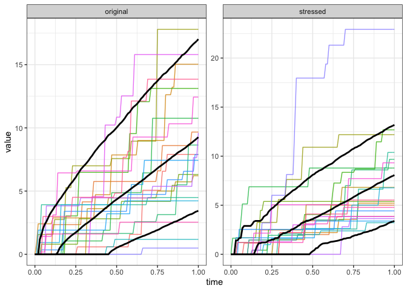

<!-- README.md is generated from README.Rmd. Please edit that file -->

# revpathsensitivity

<!-- badges: start -->
<!-- badges: end -->

The goal of revpathsensitivity is to …

## Installation

You can install the development version of revpathsensitivity from
[GitHub](https://github.com/) with:

``` r
# install.packages("devtools")
devtools::install_github("emmakroell/revpathsensitivity")
```

## Example

``` r
library(revpathsensitivity)
```

In this example, we set the jump size distribution to *Γ*(*α*,*β*) where
*α* = 2 and *β* = 1. We first create a class containing all the
information needed on this random variable.

``` r
# jump size is Gamma(2,1) distributed
# Set up distribution class
gamma_2_1 <- new_RPS_dist(dist_fun = function(x,parms) pgamma(x,shape=parms$alpha,
                                                              rate=parms$beta),
                          dens_fun = function(x,parms) dgamma(x,shape=parms$alpha,
                                                              rate=parms$beta),
                          sim_fun = function(x,parms) rgamma(x,shape=parms$alpha,
                                                             rate=parms$beta),
                          char_fun = function(x,parms) (1 - 1i*x/parms$beta)^(-parms$alpha),
                          mean_fun = function(parms) parms$alpha/parms$beta,
                          parms = list(alpha = 2, beta=1)) 
```

We decide to stress the 90% VaR of the model down about 20%. this code
imposes the stress and simulates under the model.

``` r
# simulate
gamma_2_1_example <- stressed_sim(kappa = 5, jump_dist = gamma_2_1, 
                                  stress_type = "VaR",
                                  stress_parms = list(c=0.9,q=14),
                                  Npaths=1e4, endtime=1, dt=1e-2)
```

Here we plot the output of the stressed model.

``` r
path_plot(gamma_2_1_example, Npaths=20, quantiles=list(lower=0.1,upper=0.9))
```


We can also compare the paths under the stressed model to those under
the baseline model.

``` r
path_plot(gamma_2_1_example,
          Npaths = 20,
          quantiles=list(lower=0.1,upper=0.9),
          plot_type = "compare_to_baseline")
```



Finally, we can examine how the intensity of the jumps have changed
under the stressed probability measure.

``` r
path_plot(gamma_2_1_example,
          Npaths = 10,
          plot_type = "compare_to_kappa")
```


