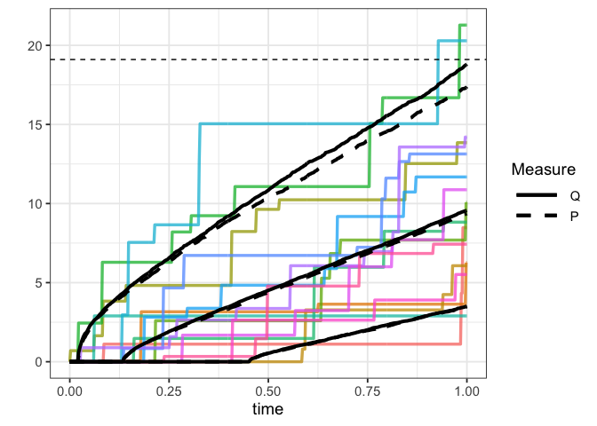

<!-- README.md is generated from README.Rmd. Please edit that file -->

# revpathsensitivity

<!-- badges: start -->
<!-- badges: end -->

This code implements reverse sensitivity testing on compound Poisson
processes. This is joint work with Silvana M. Pesenti and Sebastian
Jaimungal. This is a work in progress.

## Installation

You can install the development version of revpathsensitivity from
[GitHub](https://github.com/) with:

``` r
# install.packages("devtools")
devtools::install_github("emmakroell/revpathsensitivity")
```

## Example

``` r
library(revpathsensitivity)
```

In this example, we set the jump size distribution to *Γ*(*α*,*β*) where
*α* = 2 and *β* = 1. We first create a class containing all the
information needed on this random variable.

``` r
# jump size is Gamma(2,1) distributed
# Set up distribution class
gamma_2_1 <- new_RPS_dist(dist_fun = function(x,parms) pgamma(x,shape=parms$alpha,
                                                              rate=parms$beta),
                          dens_fun = function(x,parms) dgamma(x,shape=parms$alpha,
                                                              rate=parms$beta),
                          sim_fun = function(x,parms) rgamma(x,shape=parms$alpha,
                                                             rate=parms$beta),
                          char_fun = function(x,parms) (1 - 1i*x/parms$beta)^(-parms$alpha),
                          mean_fun = function(parms) parms$alpha/parms$beta,
                          parms = list(alpha = 2, beta=1)) 
```

We decide to stress the 90% VaR of the model up 10%. This code imposes
the stress and simulates under the model.

``` r
ex_gamma_VaR <- stressed_sim(kappa = 5, jump_dist = gamma_2_1, 
                             stress_type = "VaR",
                             stress_parms = list(c=0.9,VaR_stress=1.1),
                             Npaths=1e4, endtime=1, dt=2e-3)
```

Here we plot the output of the stressed model. We compare the paths
under the stressed model to those under the baseline model, as well as
to how the intensity of the jumps have changed under the stressed
probability measure.

``` r
plot_paths(ex_gamma_VaR, Npaths=15, quantiles=list(lower=0.1,upper=0.9))
```



### CVaR constraint

Now we want to impose an additional constraint, corresponding to an 8%
increase in CVaR (also known as Expected Shortfall).

``` r
ex_gamma_CVaR <- stressed_sim(kappa = 5, jump_dist = gamma_2_1,
                              stress_type = "CVaR", 
                              stress_parms = list(c=0.9,
                                                 VaR_stress=1.1,
                                                 CVaR_stress=1.08),
                              Npaths=1e4, endtime=1, dt=2e-3)
```

Here we plot the paths of the stressed model as well as the jump
intensity over time.

``` r
plot_paths(ex_gamma_CVaR, Npaths=15, quantiles=list(lower=0.1,upper=0.9))
```


### Bivariate example

We can also examine the case where *X*<sub>*t*</sub> is bivariate and a
stress is applied to only the first component,
*X*<sub>*t*</sub><sup>1</sup>. In this example, we set the severity
distributions to both be *Γ*(2,1) with a dependence relationship given
by the *t*-copula with correlation 0.8 and 3 degrees of freedom. The
implementation of a *t*-copula with fixed marginals is done using the
`copula` package.

``` r
gamma_t <- new_RPS_dist_biv(copula=copula::tCopula(0.8,df=3,dim=2),
                            margins=c("gamma", "gamma"),
                            sim_fun = function(x,parms) rgamma(x,shape=parms$alpha1,
                                                           rate=parms$beta1),
                            dens_fun = function(x,parms) dgamma(x,shape=parms$alpha1,
                                                            rate=parms$beta1),
                            char_fun = function(x,parms) (1 - 1i*x/parms$beta1)^
                              (-parms$alpha1),
                            mean_fun = function(parms) parms$alpha1/parms$beta1,
                            parms = list(alpha1 = 2, beta1=1, alpha2=2, beta2=1))
```

Here we examine the effect of a 10% increase in
VaR<sub>0.9</sub>(*X*<sub>*T*</sub><sup>1</sup>) at the 90% level.

``` r
gamma_t_ex <- stressed_sim_biv(kappa = 5, jump_dist = gamma_t,
                               stress_type = "VaR",
                               stress_parms = list(c=0.9,VaR_stress=1.1),
                               Npaths=1e4, endtime=1, dt=2e-3)
#> eta: 0.4833721
```

``` r
plot_paths_biv(gamma_t_ex, Npaths=15, quantiles=list(lower=0.1,upper=0.9))
```


We can also plot the contours of the copula density under ℙ and ℚ.Here
we plot it at the terminal time, *t* = 1:

``` r
plot_copula_dens_contour(gamma_t_ex,time=1)
```


